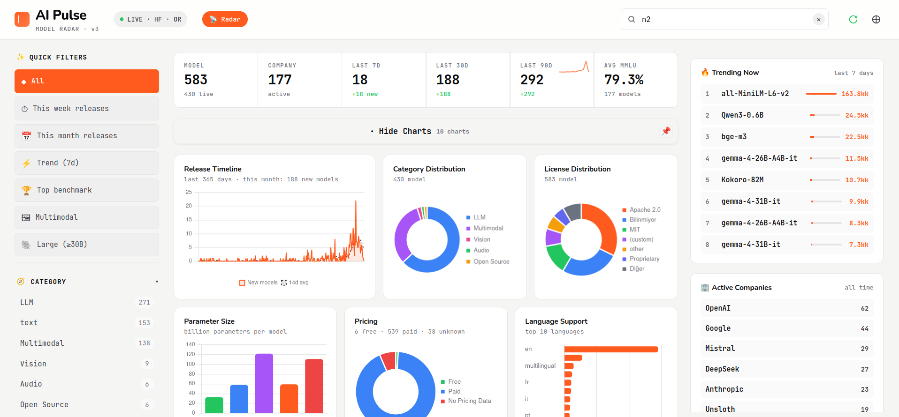
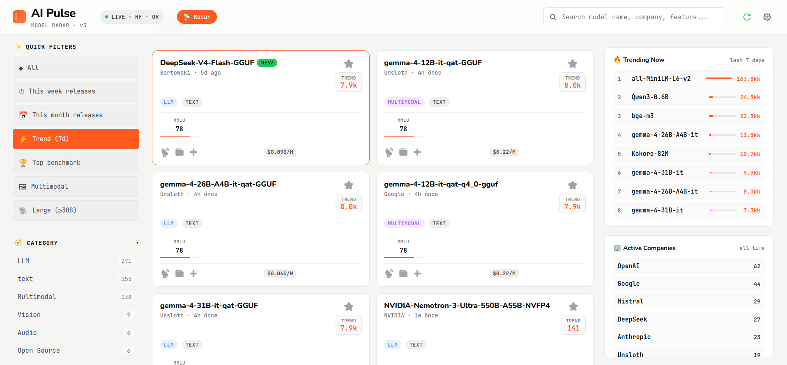
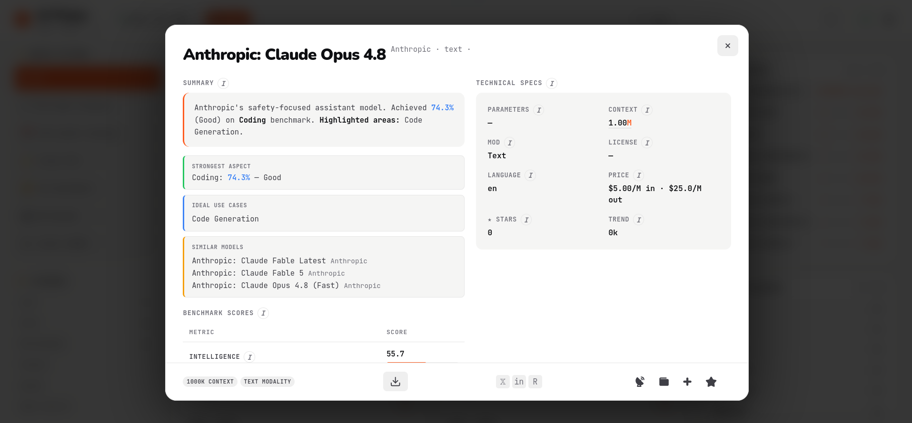
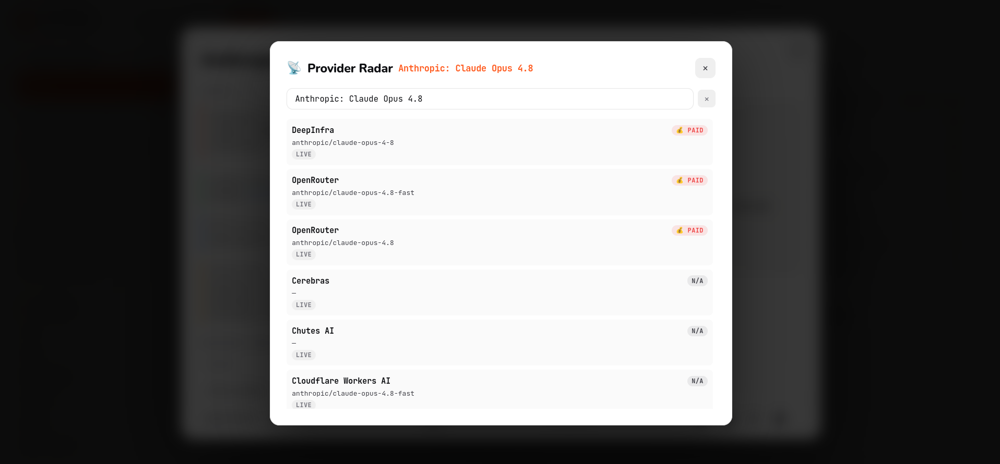
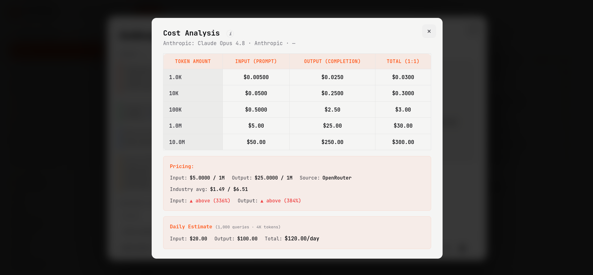
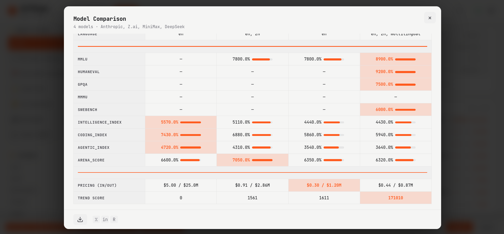

# AI Pulse — Model Radar

> Track AI models from 170+ companies in one clean, zero-build dashboard — and update it yourself, any time, to catch every new model as it drops. No server, no install — just open and go.

   

https://aipulses.vercel.app **[💳 Get Full Version](#)**

---

## What is this?

AI Pulse — Model Radar is a single-file dashboard that brings together everything you need to compare AI models in one place: parameters, context window, pricing, benchmarks, licensing, and community traction — without digging through a dozen leaderboards and provider docs.

The AI landscape moves fast — new models ship almost daily. That's why the full version isn't a static snapshot: you run the update yourself, whenever you want, and pull in every new model as it's released. No subscription, no waiting on us — your dashboard, your pace.

Open the dashboard file, and it just works in your browser — no build step, no server. The update pipeline requires Python 3.8+ (no pip packages needed).

---

## ✨ Highlights

- **600+ models, 170+ companies** — from flagship LLMs to open-weight and multimodal models
- **Update anytime** — run it yourself and pull in every new model the moment it's released, no waiting on us
- **Side-by-side model comparison** — pick any models and compare specs, benchmarks, and pricing in one table, then export as PDF, PNG, or CSV
- **Cost analysis** — input/output pricing per 1K and 1M tokens, laid out for quick comparison across models
- **10 interactive charts** — release trends, category breakdowns, pricing, benchmark comparisons, and more
- **Instant search** — find models by name, company, feature, or language in real time
- **Smart filters** — quick presets (This Week, Trending, Open Weight, Large Models...) plus category/modality/company/license facets
- **Full model cards** — benchmarks, pricing, context window, and source links at a glance
- **Live free-tier provider check** — see where a model is available for free across multiple providers, right from your browser
- **Dark/light themes**, grid/list views, responsive layout

---

## 🎥 Demo Video
You can watch a screen recording of the app <a href="https://github.com/user-attachments/assets/eda22a95-a6db-425d-b855-4637e7873ab3" target="_blank">via this link</a>.
## 🖼 Screenshots

---

## 🎥 Demo
This repo includes a limited demo (50 models, restricted company list, core features only) — try it live: https://aipulses.vercel.app/

Model and pricing data can shift within hours, so the demo is intentionally a snapshot, not the real thing. The full version gets you:
- The complete, current dataset — 600+ models across 180+ companies
- **Update it yourself, any time** — pull in every newly released model as it drops, on your own schedule, no subscription required
- Full model comparison across your entire dataset, not just the demo's 50
- Full cost analysis tables and live provider radar across 10+ APIs
- Full benchmark and pricing data for every model

https://aipulses.vercel.app/

---

## 📄 License

This repository contains a limited demo build for evaluation purposes only.
The full version is commercially licensed — redistribution and resale are prohibited.
See `LICENSE.txt` for details.

© 2026 AI Pulse. All rights reserved.
